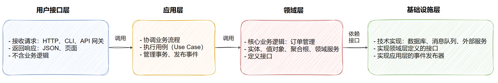

# FastAPI 依赖注入_介绍


### 🔍 什么是依赖注入？

**依赖注入（DI）** 是一种设计模式，允许我们将“功能依赖”以声明式的方式注入到路由、中间件或其他组件中。FastAPI 内建了强大的依赖注入系统，它不仅支持函数依赖，还支持类依赖、嵌套依赖等高级用法。

> ✅ 优势：
>
> - 提高代码复用性
> - 解耦业务逻辑与通用逻辑（如认证、数据库连接）
> - 支持异步依赖
> - 自动解析类型提示和参数

### 依赖注入的作用域

FastAPI 依赖注入依赖注入主要有三个级别,区别在于作用域不同：

1. **路径(Path Operation) 级别**：最常用，注入到 `@app.get()` / `@router.post()` 等装饰器下面的函数中
2. **路由(APIRouter) 级别- 共享依赖**：将依赖注入到整个路由器下的所有路径操作
3. **全局(FastAPI) 级别-全局依赖**：将依赖注入到整个应用的所有路径操作

### 💡 Depends() 基本语法

依赖可以是简单的函数或者类，FastAPI 会自动解析并执行。

#### 示例代码
```python
from fastapi import FastAPI, Depends

app = FastAPI()

# 简单依赖函数
def get_query_param(q: str = "default"):
    return q.upper()

# 使用依赖的路由
@app.get("/items/")
async def read_items(query: str = Depends(get_query_param)):
    return {"query": query}
```

> **说明**
>
> - `get_query_param` 是一个依赖函数，接收查询参数 `q` 并返回其大写形式。
> - 在 `read_items` 中，`query` 通过 `Depends(get_query_param)` 注入。
> - FastAPI 自动处理参数提取和验证。
>
> ---
>
> **测试**
>
> 访问 `/items/?q=hello` → 响应：`{"query": "HELLO"}`
>
> 如果未提供 `q`，则默认返回 `"DEFAULT"`。

```python
from fastapi import FastAPI, Depends, HTTPException

app = FastAPI()

# 定义一个依赖函数
def common_params(q: str = None, skip: int = 0, limit: int = 10):
    return {"q": q, "skip": skip, "limit": limit}

@app.get("/items/")
async def read_items(params: dict = Depends(common_params)):
    return params
```

> **测试**
>
> 访问 `/items/?q=hello&skip=2&limit=5` 会返回：
>
> ```python
> {"q": "hello",
>   "skip": 2,
>   "limit": 5}
>   ```
> 
> ---
>
> **说明**
>
> 1. 请求到达 `/items/`
>2. FastAPI 发现 `params: dict = Depends(common_params)`
> 3. 调用 `common_params(q=..., skip=..., limit=...)` 并传入当前请求参数
> 4. 将返回值注入到 `read_items` 函数中作为 `params`


**实时效果反馈**

**1. FastAPI 中的依赖注入（DI）的主要优势不包括以下哪一项？**

<font style="background-color:rgb(233, 30, 100)">A</font>   提高代码复用性

<font style="background-color:rgb(255, 197, 10)">B</font>   解耦业务逻辑与通用逻辑

<font style="background-color:#8bc34a">C</font>   支持异步依赖

<font style="background-color:rgb(2, 170, 244);">D</font>   强制使用全局变量

**2. 在 FastAPI 中，依赖注入的作用域不包括以下哪一项？**

<font style="background-color:rgb(233, 30, 100)">A</font>   路径（Path Operation）级别

<font style="background-color:rgb(255, 197, 10)">B</font>   路由（APIRouter）级别

<font style="background-color:#8bc34a">C</font>   全局（FastAPI）级别

<font style="background-color:rgb(2, 170, 244);">D</font>   数据库级别


**答案**

1=>D    2=>D


# FastAPI 依赖注入-路径级


在 FastAPI 中，**路径级依赖注入**是最常用的方式，它允许我们在单个路由中注入依赖项。

这些依赖项会在请求到达路由处理函数之前执行，并可以用于参数验证、权限检查、数据库连接管理等。

#### **特点**

1. **作用范围**：仅影响当前路径操作（单个 API 端点）。
2. **执行顺序**：依赖项在路由处理函数之前执行。
3. **参数传递**：依赖项可以访问请求参数（如 `Query`、`Path`、`Header`等）。
4. **返回值**：依赖项可以返回数据，供路由处理函数使用。

```python
from fastapi import FastAPI, Depends, HTTPException, status

app = FastAPI()

# 依赖函数：检查用户权限
def check_user_permission(token: str = Header(...)):
    if token != "secret-token":
        raise HTTPException(
            status_code=status.HTTP_403_FORBIDDEN,
            detail="Invalid token"
        )
    return {"user": "admin"}

# 路径级依赖注入
@app.get("/admin/", dependencies=[Depends(check_user_permission)])
async def admin_dashboard():
    return {"message": "Welcome to Admin Dashboard"}
```

#### **代码解析**

1. `check_user_permission`是一个依赖函数，检查请求头中的 `token`
2. 如果 `token`无效，抛出 `HTTPException`（403 错误）
3. 如果 `token`有效，返回用户信息 `{"user": "admin"}`
4. `admin_dashboard`路由使用 `dependencies=[Depends(check_user_permission)]`注入依赖

```python
from fastapi import FastAPI, Depends, Query

app = FastAPI()

# 依赖函数：获取分页参数
def get_pagination_params(
    page: int = Query(1, ge=1),
    page_size: int = Query(10, ge=1, le=100)
):
    return {"page": page, "page_size": page_size}

# 路径级依赖注入
@app.get("/items/")
async def list_items(pagination: dict = Depends(get_pagination_params)):
    return {
        "items": ["item1", "item2", "item3"],
        "current_page": pagination["page"],
        "page_size": pagination["page_size"]
    }
```

#### **代码解析**

1. `get_pagination_params`是一个依赖函数，接收 `page`和 `page_size`查询参数。
2. `page`必须 ≥ 1，`page_size`必须在 1~100 之间。
3. `list_items`路由通过 `Depends(get_pagination_params)`获取分页参数


**实时效果反馈**

**1. 路径级依赖注入的作用范围是什么？**

<font style="background-color:rgb(233, 30, 100)">A</font>   整个 FastAPI 应用的所有路由

<font style="background-color:rgb(255, 197, 10)">B</font>   当前路由（单个 API 端点）

<font style="background-color:#8bc34a">C</font>   所有 `APIRouter`下的路由

<font style="background-color:rgb(2, 170, 244);">D</font>   仅限异步路由

**2. 以下哪种情况适合使用路径级依赖注入？**

<font style="background-color:rgb(233, 30, 100)">A</font>   全局日志记录（所有请求都需要）

<font style="background-color:rgb(255, 197, 10)">B</font>   仅某个特定 API 需要权限检查

<font style="background-color:#8bc34a">C</font>   数据库连接池管理（所有路由共享）

<font style="background-color:rgb(2, 170, 244);">D</font>   整个应用的中间件处理


**答案**

1=>B    2=>B


# FastAPI 依赖注入-路由级


在 FastAPI 中，**路由级依赖注入**允许我们为整个 `APIRouter`下的所有路径操作（API 端点）注入相同的依赖项。这种方式适用于**多个路由共享相同逻辑**的情况，例如：

- **身份验证**（所有路由都需要检查 JWT Token）
- **数据库会话管理**（所有路由都需要访问数据库）
- **日志记录**（所有路由都需要记录请求信息）

#### **特点**

1. **作用范围**：影响 `APIRouter`下的所有路由。
2. **执行顺序**：依赖项在每个路由处理函数之前执行。
3. **代码复用**：避免在每个路由重复编写相同逻辑。
4. **可组合性**：可以和路径级依赖一起使用（路径级依赖优先级更高）。

### 示例代码
```python
from fastapi import FastAPI, APIRouter, Depends, HTTPException, Header

app = FastAPI()
router = APIRouter(dependencies=[Depends(check_auth)])  # 路由级依赖

# 依赖函数：检查用户权限
def check_auth(token: str = Header(...)):
    if token != "secret-token":
        raise HTTPException(status_code=403, detail="Invalid token")
    return {"user": "admin"}

# 路由1：受保护的路由
@router.get("/admin/dashboard")
async def admin_dashboard():
    return {"message": "Welcome to Admin Dashboard"}

# 路由2：受保护的路由
@router.get("/admin/users")
async def list_users():
    return {"users": ["user1", "user2"]}

app.include_router(router, prefix="/api")
```

#### **代码解析**

1. `check_auth`是一个依赖函数，检查请求头中的 `token`
2. `router = APIRouter(dependencies=[Depends(check_auth)])`表示**所有该路由下的 API 都会自动执行 `check_auth`**
3. 访问 `/api/admin/dashboard`或 `/api/admin/users`时，都会先检查 `token`


**实时效果反馈**

**1. 路由级依赖注入的作用范围是什么？**

<font style="background-color:rgb(233, 30, 100)">A</font>   整个 FastAPI 应用的所有路由

<font style="background-color:rgb(255, 197, 10)">B</font>   当前 `APIRouter`下的所有路由

<font style="background-color:#8bc34a">C</font>   仅限异步路由

<font style="background-color:rgb(2, 170, 244);">D</font>   仅限 GET 请求


**2. 以下哪种情况适合使用路由级依赖注入？**

<font style="background-color:rgb(233, 30, 100)">A</font>   仅某个特定 API 需要权限检查

<font style="background-color:rgb(255, 197, 10)">B</font>   全局日志记录（所有请求都需要）

<font style="background-color:#8bc34a">C</font>   所有 `/admin`下的路由都需要身份验证）

<font style="background-color:rgb(2, 170, 244);">D</font>   仅限 POST 请求的参数验证


**答案**

1=>B    2=>C


# FastAPI 依赖注入_全局级


在 FastAPI 中，**全局级依赖注入**允许我们为**整个应用的所有路由**注入相同的依赖项。这种方式适用于**所有 API 都需要执行的逻辑**

#### **特点**

1. **作用范围**：影响整个 FastAPI 应用的所有路由。
2. **执行顺序**：依赖项在所有路由处理函数之前执行。
3. **适用于**：跨路由的通用逻辑（如日志、认证、限流）。
4. **优先级**：低于路径级和路由级依赖（可以被覆盖）。

### 示例代码

```python
from fastapi import FastAPI, Depends, Request

app = FastAPI(dependencies=[Depends(log_request)])  # 全局级依赖

# 依赖函数：记录请求信息
async def log_request(request: Request):
    print(f"Request received: {request.method} {request.url}")
    return {"logged": True}

# 所有路由都会自动记录请求
@app.get("/items/")
async def list_items():
    return {"items": ["item1", "item2"]}

@app.post("/items/")
async def create_item():
    return {"message": "Item created"}
```

#### **代码解析**

1. `log_request`是一个依赖函数，记录请求的 `method`和 `url`。

2. `app = FastAPI(dependencies=[Depends(log_request)])`使得**所有路由自动记录请求**。

3. 无需在每个路由单独写日志逻辑，减少重复代码。

   

**实时效果反馈**

**1. 全局级依赖注入的作用范围是什么？？**

<font style="background-color:rgb(233, 30, 100)">A</font>   整个 FastAPI 应用的所有路由

<font style="background-color:rgb(255, 197, 10)">B</font>   当前 `APIRouter`下的所有路由

<font style="background-color:#8bc34a">C</font>   仅限异步路由

<font style="background-color:rgb(2, 170, 244);">D</font>   仅限 GET 请求


**2. 以下哪种情况适合使用全局级依赖注入？**

<font style="background-color:rgb(233, 30, 100)">A</font>   仅 `/admin`路由需要权限检查

<font style="background-color:rgb(255, 197, 10)">B</font>   所有请求都需要记录访问日志

<font style="background-color:#8bc34a">C</font>   某个特定 API 需要数据库连接

<font style="background-color:rgb(2, 170, 244);">D</font>   仅限 GET 请求的参数验证


**答案**

1=>A    2=>B


# FastAPI 依赖注入_嵌套依赖


在 FastAPI 中，**嵌套依赖注入**允许一个依赖项本身依赖于另一个依赖项，形成**依赖链**。这种方式适用于**复杂业务逻辑的拆分和复用**，例如：

- **权限验证 + 用户信息获取**（先验证 Token，再查询用户信息）
- **数据库连接 + 事务管理**（先获取数据库连接，再开启事务）
- **参数校验 + 业务逻辑处理**（先校验参数，再执行业务逻辑）

#### **特点**

1. **依赖链**：一个依赖可以调用另一个依赖。
2. **执行顺序**：从最外层依赖开始，逐层向内执行。
3. **代码复用**：避免重复逻辑，提高可维护性。
4. **支持异步**：嵌套依赖可以是同步或异步函数。

### 示例代码


```python
from fastapi import FastAPI, Depends, HTTPException, Header

app = FastAPI()

# 依赖1：验证 Token
def verify_token(token: str = Header(...)):
    if token != "secret-token":
        raise HTTPException(status_code=403, detail="Invalid token")
    return token

# 依赖2：获取用户信息（依赖于 verify_token）
def get_current_user(token: str = Depends(verify_token)):
    return {"user": "admin", "token": token}

# 使用嵌套依赖
@app.get("/user/")
async def get_user_info(user: dict = Depends(get_current_user)):
    return user
```

#### **代码解析**

1. `verify_token`验证请求头中的 `token`。
2. `get_current_user`依赖于 `verify_token`，并返回用户信息。
3. `get_user_info`使用 `get_current_user`，形成**依赖链**：先执行 `verify_token`→ 再执行 `get_current_user`→ 最后执行 `get_user_info`。


**实时效果反馈**

**1. 嵌套依赖的执行顺序是什么？**

<font style="background-color:rgb(233, 30, 100)">A</font>   从最内层依赖开始，逐层向外执行

<font style="background-color:rgb(255, 197, 10)">B</font>   从最外层依赖开始，逐层向内执行

<font style="background-color:#8bc34a">C</font>   随机顺序执行

<font style="background-color:rgb(2, 170, 244);">D</font>   同时执行所有依赖


**答案**

1=>B


# FastAPI 依赖注入_类依赖


在 FastAPI 中，**类依赖注入**允许我们使用**类（Class）作为依赖项**，而不仅仅是函数。这种方式特别适合**封装复杂逻辑**或**需要维护状态的场景**，例如：

- **数据库服务**（封装 CRUD 操作）
- **外部 API 客户端**（封装 HTTP 请求）
- **配置管理**（读取和缓存配置）

#### **特点**

1. **面向对象**：可以封装属性和方法。
2. **可复用性**：类实例可以在多个路由中共享。
3. **依赖嵌套**：类可以依赖其他类或函数。
4. **支持初始化参数**：可以通过 `__init__`传递配置。

### 示例代码

```python
from fastapi import FastAPI, Depends

app = FastAPI()

# 类依赖：用户服务
class UserService:
    def __init__(self, db_connection: str = "default"):
        self.db = db_connection  # 模拟数据库连接

    def get_user(self, user_id: int):
        return {"id": user_id, "name": "Alice", "db": self.db}

# 依赖函数：创建 UserService 实例
def get_user_service():
    return UserService(db_connection="prod-db")

# 使用类依赖
@app.get("/users/{user_id}")
async def read_user(
    user_id: int, 
    user_service: UserService = Depends(get_user_service)
):
    return user_service.get_user(user_id)
```

#### **代码解析**

1. `UserService`是一个类依赖，封装了用户相关操作。
2. `get_user_service`返回 `UserService`实例（可在这里初始化配置）。
3. `read_user`通过 `Depends(get_user_service)`注入 `UserService`实例。


**实时效果反馈**

**1.  类依赖的主要优势是什么？**

<font style="background-color:rgb(233, 30, 100)">A</font>   只能用于同步代码

<font style="background-color:rgb(255, 197, 10)">B</font>   可以封装状态和方法

<font style="background-color:#8bc34a">C</font>   必须全局单例

<font style="background-color:rgb(2, 170, 244);">D</font>   不能嵌套其他依赖


**答案**

1=>B


# 领域驱动设计（DDD）


DDD（Domain-Driven Design）是一个**让程序员和产品经理（或者任何提需求的人）不再“鸡同鸭讲”的超级沟通和做事的办法。**

以后工作时，可能碰到的问题：

- 代码越写越乱，改一个功能要动十几个地方。
- 数据库表设计好了，但业务逻辑全散在 Service 里，没人看得懂。
- 产品经理说“会员下单有折扣”，你却不知道该写在哪。
- 和产品沟通时总对不上口径：“你说的‘下单成功’到底指啥？”

**这些问题，DDD 就是来解决的**

### 1. DDD 的核心思想

1. **业务优先**：先搞懂业务是怎么运作的，而不是一上来就建表。
2. **统一语言**：程序员、产品经理、业务方用**同一个词**描述同一个东西。
3. **边界清晰**：把大系统拆成几个“小王国”，每个王国自己管自己

### 2. DDD 核心概念

1. **领域**：软件**要解决的那个业务范围**

2. **通用语言**：**团队里所有人（程序员、产品经理、测试等）约定好的一套“黑话”**。讨论业务、写代码、写文档都用这套话，不准出现第二种说法

   > **关键点**：**通用语言是DDD的基石**，是防止“鸡同鸭讲”的终极武器。它的词直接变成你的类名、方法名

3. **限界上下文**：**给“通用语言”划边界**。同一个词，在不同的部门（上下文）里，意思可能完全不同。限界上下文就是把这些部门隔开，让每个部门内部用自己的“方言”而不会混乱。

   > **例子**：“**订单**”这个词：
   >
   > - 在 **【用户下单上下文】** 里，“订单”关心的是：菜品、价格、优惠券、送餐地址。
   > - 在 **【后厨制作上下文】** 里，“订单”关心的是：做什么菜、做菜顺序、出餐口。
   > - 在 **【配送调度上下文】** 里，“订单”关心的是：取餐地点、送餐地点、路径规划。
   >
   > ---

   > **关键点**：你不能把这三个上下文的“订单”混在一起设计成一个巨无霸`Order`类，会复杂到爆炸。**限界上下文就是告诉你，应该把它们当成三个不同的东西来开发**，甚至可以做成三个不同的微服务。这是降低复杂度的超级大招。

4. **实体**：**有唯一ID的东西**，你看重的是“它是谁”，而不是它“是什么样”。它会变化，但它的身份（ID）不变

   > **例子**：**用户**是一个实体。因为每个用户都有一个唯一的用户ID（比如123）。用户“张三”今天可以改名叫“张四”，密码也可以改，但他的用户ID 123没变，我们就知道他还是那个“张三”。

5. **值对象**：**没ID，只看属性值的东西**。你看重的是“它是什么样”，如果两个东西的所有属性值一样，就可以认为它们是同一个东西

   > **例子**：**地址**是一个典型的值对象。你有一个地址对象：`国家=中国，城市=北京，街道=xxx路1号`。如果另一个地址对象的这些属性值完全一样，那它们就是相等的，即使它们在内存里是两个不同的对象。值对象通常还是**不可变**的，你的地址信息一旦创建就不会轻易改动，要改就是整个换掉。

6. **聚合根：一组相关对象的“老大”**，外部只能通过它来访问这组对象，它是保证业务一致性的边界。

   > **关键点**：
   >
   > - 聚合根是实体（有ID），但**不是所有实体都是聚合根**。
   > - 一个聚合包含多个实体和值对象，但**外部只能通过聚合根操作它们**（类似“黑盒”）。
   > - 聚合根负责维护聚合内部的业务规则一致性。

   #### **为什么需要聚合根？**

   假设“订单”是一个聚合根，包含：

   - 订单实体（根）
   - 订单项（子实体）
   - 配送地址（值对象）

   **没有聚合根时的混乱**：

   - 代码可能直接修改`OrderItem`的价格，导致订单总价不一致。
   - 可能误删`Address`，导致订单数据不完整。

   **有聚合根后的规则**：

   - 要改订单项？必须通过`Order`聚合根的方法（如`order.updateItem()`），它会自动重新计算总价。
   - 要删地址？必须调用`Order.changeAddress()`，确保新地址有效后才替换旧地址。

   #### **如何识别聚合根？**

   1. **业务高频操作点**：比如“下单”场景中，`Order`是天然聚合根。
   2. **强一致性需求**：比如“银行账户”转账，`Account`必须是聚合根，保证余额变化原子性。
   3. **生命周期控制**：比如“论坛帖子”删除时，连带回复一起删，`Post`就是聚合根

7. **领域服务**: 处理那些不属于任何实体/值对象的业务逻辑，通常是跨聚合的、无状态的、需要协调多个领域对象的操作

   > **关键点**：
   >
   > - 领域服务是**领域层**的组件（不是应用服务！）。
   > - 它本身**没有状态**（不保存数据），但操作有状态的领域对象。
   > - 命名通常是动词短语（如`TransferService`），而实体/值对象是名词（如`Account`）。

假设你要实现“从账户A转账100元到账户B”。

这个操作涉及两个账户，你不能把 `transferTo` 方法放在 `Account` 类里，因为那会变成：

```PYTHON
accountA.transferTo(accountB, 100); 
```

> 解决方案：`TransferService.execute(from_account, to_account, amount)`


### 3. DDD 分层架构

领域驱动设计（DDD）推荐的分层架构，各层职责明确、依赖单向，确保业务核心（领域层）不受技术细节污染。



1. **用户接口层（User Interface Layer）**  
   - **别名**：表现层、Web 层、接口层、Controller 层  
   - **职责**：
     - 接收外部请求（如 HTTP、RPC、CLI）
     - 解析输入参数（如 JSON、表单）
     - 执行基础校验（如非空、格式）
     - 调用应用层服务完成业务操作
     - 返回响应结果（如 JSON、页面）
   - **不包含**：
     - 业务规则判断
     - 领域逻辑
   - **依赖**：
     - 仅依赖 **应用层**（调用应用服务）
     - 示例：`OrderController` → `PlaceOrderService`
2. **应用层（Application Layer）**  
   - **别名**：用例层、服务门面层  
   - **职责**：
     - 协调领域对象完成一个完整的业务用例（如“下单”、“转账”）
     - 处理事务边界（如开启事务）
     - 发布领域事件
     - 转换 DTO（数据传输对象）
     - 不包含核心业务规则（只“指挥”，不“决策”）
   - **组件示例**：
     - 应用服务（`PlaceOrderService`）
     - Command/Query 对象
     - DTO（Data Transfer Object）
   - **依赖**：
     - 依赖 **领域层**（使用实体、聚合、领域服务）
     - 依赖 **基础设施层**（获取 Repository 实现）
     - 被 **用户界面层** 调用
3. **领域层（Domain Layer）**  
   - **别名**：模型层、核心层  
   - **职责**：
     - 包含系统的核心业务逻辑和规则
     - 定义领域模型：
       - 实体
       - 值对象
       - 聚合根
       - 领域服务
       - 领域事件
     - 保证业务一致性（如订单金额不能为负）
     - **不依赖任何外部框架**（如  Flask、Django、FastAPI、SQLAlchemy）
   - **关键原则**：
     - 业务逻辑必须在这里实现
     - 聚合根负责维护内部一致性
   - **依赖**：
     - **无依赖**（理想情况下不依赖其他层）
     - 被 **应用层** 调用
4. **基础设施层（Infrastructure Layer）**  
   - **别名**：数据访问层、技术实现层  
   - **职责**：
     - 提供技术实现，支撑上层运行
     - 实现领域层定义的接口，例如：
       - `OrderRepository` 接口的具体实现（如 JPA、MyBatis）
       - 消息队列发送器（如 KafkaProducer）
       - 外部 API 调用（如支付网关）
     - 处理数据库、缓存、文件、邮件等底层操作
   - **组件示例**：
     - Repository 实现类
     - 事件发布器
     - 第三方客户端
   - **依赖**：
     - 依赖 **领域层**（实现其接口）
     - 依赖 **应用层**（如监听应用事件）
     - 被 **应用层** 和 **领域事件处理器** 调用

> 重点：**业务逻辑只在领域层**，其他层只是“搬运工”

### 4. DDD 适合什么时候用？

| 场景                           | 是否推荐 DDD           |
| ------------------------------ | ---------------------- |
| 简单的 CRUD 系统（如后台管理） | ❌ 不推荐，太重         |
| 电商、金融、ERP 等复杂业务     | ✅ 强烈推荐             |
| 团队协作多，沟通成本高         | ✅ 推荐（通用语言有用） |
| 快速验证的 MVP 项目            | ❌ 先快速做，再重构     |


# 基于DDD 开发FastAPI项目


### 🚀 开发流程概览


### 🎯 核心功能
- ✅ 用户注册/登录
- ✅ 订单查询
- ✅ DDD分层架构

### 项目目录结构

```shell
fastapi_code/
├── main.py                          # 应用入口文件
├── pyproject.toml                   # 项目配置和依赖管理
├── README.md                        # 项目说明文档
├── uv.lock                          # 依赖锁定文件
├── config/                          # 配置模块
│   └── settings.py                  # 应用配置管理
├── data/                            # 数据目录
│   ├── db.sqlite3                   # SQLite数据库文件
│   ├── db.sqlite3-shm               # SQLite共享内存文件
│   └── db.sqlite3-wal               # SQLite预写日志文件
└── app/                             # 主应用目录
    ├── __init__.py                  # 应用包初始化
    ├── domain/                      # 领域层
    │   ├── __init__.py
    │   ├── shared/                  # 共享领域对象
    │   │   ├── __init__.py
    │   │   └── vo.py                # 值对象定义
    │   └── user/                    # 用户领域
    │       ├── __init__.py
    │       ├── entity.py            # 用户实体
    │       └── repository.py        # 用户仓储接口
    ├── application/                 # 应用层
    │   ├── __init__.py
    │   ├── common/                  # 通用应用组件
    │   │   ├── __init__.py
    │   │   └── exception.py         # 业务异常定义
    │   └── user/                    # 用户应用服务
    │       ├── __init__.py
    │       ├── commands/            # 命令处理器
    │       │   ├── __init__.py
    │       │   ├── login_user.py    # 用户登录命令
    │       │   └── register_user.py # 用户注册命令
    │       └── queries/             # 查询处理器
    │           ├── __init__.py
    │           └── get_orders.py    # 获取订单查询
    ├── infrastructure/              # 基础设施层
    │   ├── __init__.py
    │   ├── database/                # 数据库相关
    │   │   ├── __init__.py
    │   │   ├── orm_models.py        # ORM模型定义
    │   │   └── mappers.py           # 实体映射器
    │   └── repository/              # 仓储实现
    │       ├── __init__.py
    │       └── user_impl.py         # 用户仓储实现
    └── interface/                   # 接口层
        ├── __init__.py
        ├── dependency.py            # 依赖注入配置
        └── api/                     # API接口
            ├── __init__.py
            └── v1/                  # API版本1
                ├── __init__.py
                ├── auth_router.py   # 认证路由
                └── order_router.py  # 订单路由
```

### 六个开发阶段

#### 第一阶段：项目基础设置 (2个文件)
**目标**: 建立项目基础环境和配置

1. **项目初始化** - `pyproject.toml` - 定义依赖和项目信息
2. **应用配置** - `config/settings.py` - 统一配置管理

#### 第二阶段：领域层开发 (3个文件)
**目标**: 定义核心业务模型和规则

3. **共享值对象** - `app/domain/shared/vo.py` - 定义UserId等值对象
4. **用户实体** - `app/domain/user/entity.py` - 定义User业务实体
5. **仓储接口** - `app/domain/user/repository.py` - 定义数据访问抽象

#### 第三阶段：基础设施层开发 (3个文件)
**目标**: 实现数据持久化和外部依赖

6. **ORM模型** - `app/infrastructure/database/orm_models.py` - 数据库表结构
7. **实体映射器** - `app/infrastructure/database/mappers.py` - 实体与ORM转换
8. **仓储实现** - `app/infrastructure/repository/user_impl.py` - 仓储接口实现

#### 第四阶段：应用层开发 (4个文件)
**目标**: 实现业务逻辑和用例

9. **通用异常** - `app/application/common/exception.py` - 业务异常定义
10. **用户注册命令** - `app/application/user/commands/register_user.py` - 注册业务逻辑
11. **用户登录命令** - `app/application/user/commands/login_user.py` - 登录业务逻辑
12. **订单查询** - `app/application/user/queries/get_orders.py` - 查询业务逻辑

#### 第五阶段：接口层开发 (3个文件)
**目标**: 提供API接口和依赖注入
13. **依赖注入** - `app/interface/dependency.py` - 依赖管理配置
14. **认证路由** - `app/interface/api/v1/auth_router.py` - 认证API接口
15. **订单路由** - `app/interface/api/v1/order_router.py` - 订单API接口

#### 第六阶段：应用入口 (1个文件)
**目标**: 启动应用和生命周期管理

16. **主应用文件** - `main.py` - 应用启动和配置

### 详细开发内容

### 第一阶段：项目基础设置
**目标**: 建立项目基础环境和配置  

#### 1. 项目初始化
- **文件**: `pyproject.toml`
- **目的**: 定义项目依赖和配置
- **具体开发内容**: 
  - 设置项目基本信息：name = "fastapi-code2", version = "0.1.0"
  - 添加核心依赖：
    - fastapi>=0.104.1 (Web框架)
    - uvicorn[standard]>=0.24.0 (ASGI服务器)
    - tortoise-orm[asyncpg]>=0.20.0 (异步ORM)
    - python-dotenv>=1.0.0 (环境变量管理)
    - pydantic>=2.5.0 (数据验证)
    - pydantic-settings>=2.1.0 (配置管理)

#### 2. 应用配置
- **文件**: `config/settings.py`
- **目的**: 统一管理应用配置
- **具体开发内容**:
  - 创建Settings类继承BaseSettings
  - 定义应用配置：app_name、app_version、debug、secret_key
  - 定义数据库配置：db_url = "sqlite://./data/db.sqlite3"
  - 配置环境变量支持：env_file = ".env"
  - 创建全局配置实例：settings = Settings()

### 第二阶段：领域层开发
**目标**: 定义核心业务模型和规则  

#### 3. 共享值对象
- **文件**: `app/domain/shared/vo.py`
- **目的**: 定义领域中的值对象
- **具体开发内容**:
  - 创建UserId值对象类：
    ```python
    @dataclass(frozen=True)
    class UserId:
        value: int
        def __post_init__(self):
            if self.value <= 0:
                raise ValueError("用户ID必须大于0")
    ```
  - 使用dataclass和frozen=True确保不可变性
  - 添加业务规则验证：用户ID必须大于0

#### 4. 用户实体
- **文件**: `app/domain/user/entity.py`

- **目的**: 定义用户领域实体

- **具体开发内容**:
  - 创建User实体类：
    ```python
    @dataclass
    class User:
        id: Optional[UserId]
        username: str
        password: str
    ```
    
  - 实现业务方法：
    - verify_password(password: str) -> bool：验证密码
    - change_password(new_password: str) -> None：修改密码
    
  - 添加数据验证逻辑：用户名和密码不能为空
  
  - 导入UserId值对象：from ..shared.vo import UserId
  
    ```python
    """
    用户实体
    """
    from dataclasses import dataclass
    from typing import Optional
    from ..shared.vo import UserId
    
    
    @dataclass
    class User:
        """用户实体"""
        id: Optional[UserId]
        username: str
        password: str  # 明文密码，按需求不加密
        
        def __post_init__(self):
            if not self.username:
                raise ValueError("用户名不能为空")
            if not self.password:
                raise ValueError("密码不能为空")
        
        def verify_password(self, password: str) -> bool:
            """验证密码"""
            return self.password == password
        
        def change_password(self, new_password: str) -> None:
            """修改密码"""
            if not new_password:
                raise ValueError("新密码不能为空")
            self.password = new_password
    ```

#### 5. 仓储接口
- **文件**: `app/domain/user/repository.py`

- **目的**: 定义用户仓储抽象接口

- **具体开发内容**:
  - 创建UserRepository抽象基类
    
  - 导入必要的类型：User、UserId、Optional、List
  
  - 遵循依赖倒置原则，定义抽象接口
  
    ```python
    """
    用户仓储接口
    """
    from abc import ABC, abstractmethod
    from typing import Optional, List
    from .entity import User
    from ..shared.vo import UserId
    
    class UserRepository(ABC):
        """用户仓储接口"""
        @abstractmethod
        async def save(self, user: User) -> User:
            """保存用户"""
            pass
        @abstractmethod
        async def find_by_id(self, user_id: UserId) -> Optional[User]:
            """根据ID查找用户"""
            pass 
        @abstractmethod
        async def find_by_username(self, username: str) -> Optional[User]:
            """根据用户名查找用户"""
            pass 
        @abstractmethod
        async def exists_by_username(self, username: str) -> bool:
            """检查用户名是否存在"""
            pass 
        @abstractmethod
        async def delete(self, user_id: UserId) -> bool:
            """删除用户"""
            pass
        @abstractmethod
        async def find_all(self) -> List[User]:
            """查找所有用户"""
            pass
    ```
  
    

### 第三阶段：基础设施层开发
**目标**: 实现数据持久化和外部依赖 

#### 6. ORM模型
- **文件**: `app/infrastructure/database/orm_models.py`

- **目的**: 定义数据库表结构

- **具体开发内容**:
  - 创建UserORM模型类：
    ```python
    """
    Tortoise ORM 模型
    """
    from tortoise.models import Model
    from tortoise import fields
    
    
    class UserORM(Model):
        """用户ORM模型"""
        id = fields.IntField(pk=True)
        username = fields.CharField(max_length=50, unique=True)
        password = fields.CharField(max_length=255)  # 明文密码
        created_at = fields.DatetimeField(auto_now_add=True)
        updated_at = fields.DatetimeField(auto_now=True)
        
        class Meta:
            table = "users"
    ```
    
  - 导入Tortoise ORM：from tortoise.models import Model, from tortoise import fields
  
  - 设置字段约束：username唯一性、密码长度限制
  
  - 配置自动时间戳：created_at、updated_at

#### 7. 实体映射器
- **文件**: `app/infrastructure/database/mappers.py`
- **目的**: 实现领域实体与ORM模型的转换
- **具体开发内容**:
  - 创建UserMapper类：
    ```python
    """
    实体与ORM模型映射器
    """
    from typing import Optional
    from app.domain.user.entity import User
    from app.domain.shared.vo import UserId
    from app.infrastructure.database.orm_models import UserORM
    
    
    class UserMapper:
        """用户实体映射器"""
        
        @staticmethod
        def to_entity(orm_model: UserORM) -> User:
            """ORM模型转实体"""
            return User(
                id=UserId(orm_model.id) if orm_model.id else None,
                username=orm_model.username,
                password=orm_model.password
            )
        
        @staticmethod
        def to_orm(entity: User) -> UserORM:
            """实体转ORM模型"""
            orm_model = UserORM()
            if entity.id:
                orm_model.id = entity.id.value
            orm_model.username = entity.username
            orm_model.password = entity.password
            return orm_model
    ```
  - 导入相关类型：User、UserId、UserORM
  - 处理ID值对象的转换：UserId <-> int
  - 实现双向转换：实体转ORM、ORM转实体

#### 8. 仓储实现
- **文件**: `app/infrastructure/repository/user_impl.py`
- **目的**: 实现用户仓储接口
- **具体开发内容**:
  - 创建TortoiseUserRepository类：
    ```python
    """
    用户仓储具体实现
    """
    from typing import Optional, List
    from tortoise.exceptions import IntegrityError
    from app.domain.user.entity import User
    from app.domain.user.repository import UserRepository
    from app.domain.shared.vo import UserId
    from app.infrastructure.database.orm_models import UserORM
    from app.infrastructure.database.mappers import UserMapper
    
    
    class TortoiseUserRepository(UserRepository):
        """基于Tortoise ORM的用户仓储实现"""
        
        async def save(self, user: User) -> User:
            """保存用户"""
            try:
                orm_model = UserMapper.to_orm(user)
                await orm_model.save()
                return UserMapper.to_entity(orm_model)
            except IntegrityError as e:
                if "UNIQUE constraint failed" in str(e):
                    raise ValueError(f"用户名 '{user.username}' 已存在")
                raise e
        
        async def find_by_id(self, user_id: UserId) -> Optional[User]:
            """根据ID查找用户"""
            orm_model = await UserORM.get_or_none(id=user_id.value)
            if orm_model:
                return UserMapper.to_entity(orm_model)
            return None
        
        async def find_by_username(self, username: str) -> Optional[User]:
            """根据用户名查找用户"""
            orm_model = await UserORM.get_or_none(username=username)
            if orm_model:
                return UserMapper.to_entity(orm_model)
            return None
        
        async def exists_by_username(self, username: str) -> bool:
            """检查用户名是否存在"""
            return await UserORM.filter(username=username).exists()
        
        async def delete(self, user_id: UserId) -> bool:
            """删除用户"""
            deleted_count = await UserORM.filter(id=user_id.value).delete()
            return deleted_count > 0
        
        async def find_all(self) -> List[User]:
            """查找所有用户"""
            orm_models = await UserORM.all()
            return [UserMapper.to_entity(orm_model) for orm_model in orm_models]
    ```
  - 导入必要的依赖：UserRepository、User、UserId、UserORM、UserMapper
  - 实现所有仓储接口方法
  - 处理数据库异常：IntegrityError转换为业务异常
  - 使用UserMapper进行实体转换

### 第四阶段：应用层开发
**目标**: 实现业务逻辑和用例 

#### 9. 通用异常
- **文件**: `app/application/common/exception.py`
- **目的**: 定义应用层通用异常
- **具体开发内容**:
  - 创建DomainException基类：
    ```python
    """
    通用业务异常
    """
    from typing import Optional
    
    
    class DomainException(Exception):
        """领域异常基类"""
        def __init__(self, message: str, code: Optional[str] = None):
            self.message = message
            self.code = code
            super().__init__(self.message)
    
    
    class AuthError(DomainException):
        """认证异常"""
        def __init__(self, message: str = "认证失败"):
            super().__init__(message, "AUTH_ERROR")
    
    
    class DuplicateError(DomainException):
        """重复数据异常"""
        def __init__(self, message: str = "数据已存在"):
            super().__init__(message, "DUPLICATE_ERROR")
    
    
    class NotFoundError(DomainException):
        """未找到异常"""
        def __init__(self, message: str = "数据未找到"):
            super().__init__(message, "NOT_FOUND_ERROR")
    
    
    class ValidationError(DomainException):
        """验证异常"""
        def __init__(self, message: str = "数据验证失败"):
            super().__init__(message, "VALIDATION_ERROR")
    ```
  - 定义具体业务异常：
    - AuthError：认证失败异常
    - DuplicateError：重复数据异常
    - NotFoundError：未找到异常
    - ValidationError：验证异常
  - 统一异常格式：message + code
  - 导入Optional类型支持

#### 10. 用户注册命令
- **文件**: `app/application/user/commands/register_user.py`
- **目的**: 处理用户注册业务逻辑
- **具体开发内容**:
  - 定义命令和结果类：
    ```python
    """
    用户注册命令处理器
    """
    from dataclasses import dataclass
    from app.domain.user.entity import User
    from app.domain.user.repository import UserRepository
    from app.application.common.exception import DuplicateError, ValidationError
    
    @dataclass
    class RegisterUserCommand:
        """用户注册命令"""
        username: str
        password: str
    @dataclass
    class RegisterUserResult:
        """用户注册结果"""
        user_id: int
        username: str
    class RegisterUserHandler:
        """用户注册命令处理器"""
        
        def __init__(self, user_repository: UserRepository):
            self.user_repository = user_repository
        
        async def handle(self, command: RegisterUserCommand) -> RegisterUserResult:
            """处理用户注册命令"""
            # 验证输入
            if not command.username or not command.username.strip():
                raise ValidationError("用户名不能为空")
            
            if not command.password or not command.password.strip():
                raise ValidationError("密码不能为空")
            
            # 检查用户名是否已存在
            if await self.user_repository.exists_by_username(command.username):
                raise DuplicateError(f"用户名 '{command.username}' 已存在")
            
            # 创建用户实体
            user = User(
                id=None,  # 新用户，ID由数据库生成
                username=command.username.strip(),
                password=command.password.strip()
            )
            
            # 保存用户
            saved_user = await self.user_repository.save(user)
            
            return RegisterUserResult(
                user_id=saved_user.id.value if saved_user.id else 0,
                username=saved_user.username
            )
    ```
  - 实现RegisterUserHandler类：
    - 构造函数注入UserRepository
    - handle方法处理注册逻辑
    - 输入验证：用户名和密码不能为空
    - 业务规则检查：用户名唯一性
    - 创建User实体并保存
  - 导入相关依赖：User、UserRepository、UserId、异常类

#### 11. 用户登录命令
- **文件**: `app/application/user/commands/login_user.py`
- **目的**: 处理用户登录业务逻辑
- **具体开发内容**:
  - 定义命令和结果类：
    ```python
    """
    用户登录命令处理器
    """
    from dataclasses import dataclass
    from app.domain.user.repository import UserRepository
    from app.application.common.exception import AuthError, ValidationError
    
    
    @dataclass
    class LoginUserCommand:
        """用户登录命令"""
        username: str
        password: str
    
    
    @dataclass
    class LoginUserResult:
        """用户登录结果"""
        user_id: int
        username: str
    
    
    class LoginUserHandler:
        """用户登录命令处理器"""
        
        def __init__(self, user_repository: UserRepository):
            self.user_repository = user_repository
        
        async def handle(self, command: LoginUserCommand) -> LoginUserResult:
            """处理用户登录命令"""
            # 验证输入
            if not command.username or not command.username.strip():
                raise ValidationError("用户名不能为空")
            
            if not command.password or not command.password.strip():
                raise ValidationError("密码不能为空")
            
            # 查找用户
            user = await self.user_repository.find_by_username(command.username.strip())
            if not user:
                raise AuthError("用户名或密码错误")
            
            # 验证密码
            if not user.verify_password(command.password.strip()):
                raise AuthError("用户名或密码错误")
            
            return LoginUserResult(
                user_id=user.id.value if user.id else 0,
                username=user.username
            )
    ```
  - 实现LoginUserHandler类：
    - 构造函数注入UserRepository
    - handle方法处理登录逻辑
    - 输入验证：用户名和密码不能为空
    - 用户查找：根据用户名查找用户
    - 密码验证：调用实体验证方法
    - 返回登录结果
  - 导入相关依赖：User、UserRepository、UserId、异常类

#### 12. 订单查询
- **文件**: `app/application/user/queries/get_orders.py`
- **目的**: 处理订单查询业务逻辑
- **具体开发内容**:
  - 定义查询和结果类：
    ```python
    """
    获取订单查询处理器
    """
    from dataclasses import dataclass
    from typing import List, Optional
    from app.application.common.exception import ValidationError
    
    
    @dataclass
    class GetOrdersQuery:
        """获取订单查询"""
        user_id: int
        limit: Optional[int] = 10
        offset: Optional[int] = 0
    
    
    @dataclass
    class OrderDto:
        """订单数据传输对象"""
        id: int
        order_number: str
        total_amount: float
        status: str
        created_at: str
        updated_at: str
    
    
    @dataclass
    class GetOrdersResult:
        """获取订单结果"""
        orders: List[OrderDto]
        total: int
    
    
    class GetOrdersHandler:
        """获取订单查询处理器"""
        
        def __init__(self):
            # 这里应该注入订单仓储，但为了简化，我们使用模拟数据
            pass
        
        async def handle(self, query: GetOrdersQuery) -> GetOrdersResult:
            """处理获取订单查询"""
            # 验证输入
            if query.user_id <= 0:
                raise ValidationError("用户ID必须大于0")
            
            if query.limit and query.limit <= 0:
                raise ValidationError("限制数量必须大于0")
            
            if query.offset and query.offset < 0:
                raise ValidationError("偏移量不能为负数")
            
            # 模拟订单数据（实际应该从仓储获取）
            mock_orders = [
                OrderDto(
                    id=1,
                    order_number="ORD001",
                    total_amount=99.99,
                    status="已完成",
                    created_at="2030-01-01T10:00:00",
                    updated_at="2030-01-01T12:00:00"
                ),
                OrderDto(
                    id=2,
                    order_number="ORD002",
                    total_amount=199.99,
                    status="处理中",
                    created_at="2030-01-02T10:00:00",
                    updated_at="2030-01-02T10:00:00"
                )
            ]
            
            # 应用分页
            start = query.offset or 0
            end = start + (query.limit or 10)
            paginated_orders = mock_orders[start:end]
            
            return GetOrdersResult(
                orders=paginated_orders,
                total=len(mock_orders)
            )
    
    ```
  - 实现GetOrdersHandler类：
    - handle方法处理查询逻辑
    - 输入验证：user_id、limit、offset验证
    - 模拟订单数据（实际应连接订单仓储）
    - 分页处理：应用limit和offset
    - 返回查询结果
  - 导入相关依赖：ValidationError、List、Optional

### 第五阶段：接口层开发
**目标**: 提供API接口和依赖注入

#### 13. 依赖注入
- **文件**: `app/interface/dependency.py`
- **目的**: 配置依赖注入容器
- **具体开发内容**:
  - 定义依赖工厂函数：
    ```python
    """
    依赖注入容器
    """
    from fastapi import Depends
    from app.infrastructure.repository.user_impl import TortoiseUserRepository
    from app.domain.user.repository import UserRepository
    from app.application.user.commands.register_user import RegisterUserHandler
    from app.application.user.commands.login_user import LoginUserHandler
    from app.application.user.queries.get_orders import GetOrdersHandler
    
    
    def get_user_repository() -> UserRepository:
        """获取用户仓储实例"""
        return TortoiseUserRepository()
    def get_register_user_handler(
        user_repository: UserRepository = Depends(get_user_repository)
    ) -> RegisterUserHandler:
        """获取用户注册处理器"""
        return RegisterUserHandler(user_repository)
    def get_login_user_handler(
        user_repository: UserRepository = Depends(get_user_repository)
    ) -> LoginUserHandler:
        """获取用户登录处理器"""
        return LoginUserHandler(user_repository)
    def get_orders_handler() -> GetOrdersHandler:
        """获取订单查询处理器"""
        return GetOrdersHandler()
    ```
  - 导入相关依赖：FastAPI Depends、各Handler类、Repository实现
  - 使用FastAPI的Depends进行依赖注入
  - 连接各层之间的依赖关系

#### 14. 认证路由
- **文件**: `app/interface/api/v1/auth_router.py`

- **目的**: 提供用户认证相关的API接口

- **具体开发内容**:
  - 创建APIRouter实例：router = APIRouter(prefix="/auth", tags=["认证"])
  
  - 定义请求/响应模型：
    ```python
    """
    认证和用户路由
    """
    from fastapi import APIRouter, Depends, HTTPException, status
    from pydantic import BaseModel
    from app.interface.dependency import get_register_user_handler, get_login_user_handler
    from app.application.user.commands.register_user import RegisterUserCommand, RegisterUserHandler
    from app.application.user.commands.login_user import LoginUserCommand, LoginUserHandler
    from app.application.common.exception import DomainException
    
    
    router = APIRouter(prefix="/auth", tags=["认证"])
    
    
    class RegisterRequest(BaseModel):
        """用户注册请求"""
        username: str
        password: str
    
    
    class RegisterResponse(BaseModel):
        """用户注册响应"""
        user_id: int
        username: str
        message: str
    
    
    class LoginRequest(BaseModel):
        """用户登录请求"""
        username: str
        password: str
    
    
    class LoginResponse(BaseModel):
        """用户登录响应"""
        user_id: int
        username: str
        message: str
    
    
    @router.post("/register", response_model=RegisterResponse, status_code=status.HTTP_201_CREATED)
    async def register_user(
        request: RegisterRequest,
        handler: RegisterUserHandler = Depends(get_register_user_handler)
    ):
        """用户注册"""
        try:
            command = RegisterUserCommand(
                username=request.username,
                password=request.password
            )
            result = await handler.handle(command)
            
            return RegisterResponse(
                user_id=result.user_id,
                username=result.username,
                message="用户注册成功"
            )
        except DomainException as e:
            raise HTTPException(
                status_code=status.HTTP_400_BAD_REQUEST,
                detail=e.message
            )
        except Exception as e:
            raise HTTPException(
                status_code=status.HTTP_500_INTERNAL_SERVER_ERROR,
                detail="服务器内部错误"
            )
    
    
    @router.post("/login", response_model=LoginResponse)
    async def login_user(
        request: LoginRequest,
        handler: LoginUserHandler = Depends(get_login_user_handler)
    ):
        """用户登录"""
        try:
            command = LoginUserCommand(
                username=request.username,
                password=request.password
            )
            result = await handler.handle(command)
            
            return LoginResponse(
                user_id=result.user_id,
                username=result.username,
                message="登录成功"
            )
        except DomainException as e:
            raise HTTPException(
                status_code=status.HTTP_401_UNAUTHORIZED,
                detail=e.message
            )
        except Exception as e:
            raise HTTPException(
                status_code=status.HTTP_500_INTERNAL_SERVER_ERROR,
                detail="服务器内部错误"
            )
    ```
    
  - 实现API端点：
    - POST /register：用户注册
    - POST /login：用户登录
    
  - 异常处理：DomainException转换为HTTPException
  
  - 状态码映射：201创建、401未授权、400错误请求
  
    
  
    

#### 15. 订单路由
- **文件**: `app/interface/api/v1/order_router.py`

- **目的**: 提供订单相关的API接口

- **具体开发内容**:
  - 创建APIRouter实例：router = APIRouter(prefix="/orders", tags=["订单"])
  
  - 定义响应模型：
    ```python
    """
    订单路由
    """
    from fastapi import APIRouter, Depends, HTTPException, status, Query
    from pydantic import BaseModel
    from typing import List, Optional
    from app.interface.dependency import get_orders_handler
    from app.application.user.queries.get_orders import GetOrdersQuery, GetOrdersHandler, OrderDto
    from app.application.common.exception import DomainException
    
    
    router = APIRouter(prefix="/orders", tags=["订单"])
    
    
    class OrderResponse(BaseModel):
        """订单响应"""
        id: int
        order_number: str
        total_amount: float
        status: str
        created_at: str
        updated_at: str
    
    
    class GetOrdersResponse(BaseModel):
        """获取订单响应"""
        orders: List[OrderResponse]
        total: int
        limit: int
        offset: int
    
    
    @router.get("/", response_model=GetOrdersResponse)
    async def get_orders(
        user_id: int = Query(..., description="用户ID"),
        limit: Optional[int] = Query(10, ge=1, le=100, description="限制数量"),
        offset: Optional[int] = Query(0, ge=0, description="偏移量"),
        handler: GetOrdersHandler = Depends(get_orders_handler)
    ):
        """获取用户订单列表"""
        try:
            query = GetOrdersQuery(
                user_id=user_id,
                limit=limit,
                offset=offset
            )
            result = await handler.handle(query)
            
            return GetOrdersResponse(
                orders=[
                    OrderResponse(
                        id=order.id,
                        order_number=order.order_number,
                        total_amount=order.total_amount,
                        status=order.status,
                        created_at=order.created_at,
                        updated_at=order.updated_at
                    )
                    for order in result.orders
                ],
                total=result.total,
                limit=limit or 10,
                offset=offset or 0
            )
        except DomainException as e:
            raise HTTPException(
                status_code=status.HTTP_400_BAD_REQUEST,
                detail=e.message
            )
        except Exception as e:
            raise HTTPException(
                status_code=status.HTTP_500_INTERNAL_SERVER_ERROR,
                detail="服务器内部错误"
            )
    
    ```
    
  - 实现API端点：
    - GET /：获取订单列表
    
  - 查询参数：user_id、limit、offset
  
  - 分页支持：Query参数验证
  
  - 数据转换：OrderDto转OrderResponse
  
  - 异常处理：统一错误响应

### 第六阶段：应用入口
**目标**: 启动应用和生命周期管理 

#### 16. 主应用文件
- **文件**: `main.py`
- **目的**: 应用程序入口和配置
- **具体开发内容**:

  ```python
  from contextlib import asynccontextmanager
  from fastapi import FastAPI
  from tortoise import Tortoise
  from config.settings import settings
  from app.interface.api.v1.auth_router import router as auth_router
  from app.interface.api.v1.order_router import router as order_router
  ```

  - 创建应用生命周期管理：
    ```python
    @asynccontextmanager
    async def lifespan(app: FastAPI):
        await init_database()
        yield
        await close_database()
    ```
  - 数据库初始化函数：
    ```python
    async def init_database():
        await Tortoise.init(
            db_url=settings.db_url,
            modules={'models': ['app.infrastructure.database.orm_models']}
        )
        await Tortoise.generate_schemas()
    ```
  - 创建FastAPI应用：
    ```python
    def create_app() -> FastAPI:
        app = FastAPI(
            title=settings.app_name,
            version=settings.app_version,
            description="基于DDD架构的FastAPI应用",
            lifespan=lifespan
        )
        app.include_router(auth_router, prefix="/api/v1")
        app.include_router(order_router, prefix="/api/v1")
        return app
    ```
  - 根路径端点：返回应用信息和文档链接
  - 运行配置：uvicorn服务器配置


### 运行代码

1. 创建环境

   ```shell
   uv init
   uv venv -p 3.12 .venv
   ```

2. 安装依赖

   ```shell
   uv sync
   ```

3. 运行应用

   ```shell
   uv run main.py
   ```

4. 访问文档：`http://127.0.0.1:8000/docs`
